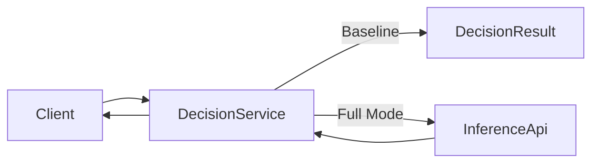

# ML Observable Prediction Platform – Architecture

## Overview

This system demonstrates a production-oriented ML architecture focused on:

- Clear service boundaries
- Safe ML integration (baseline-first)
- Observability-first design
- Versioned model outputs
- Explicit fallback handling

The system is composed of multiple services:

- **InferenceApi** – ML inference service
- **DecisionService** – Business decision layer
- **MonitoringWorker** – Model performance & health monitoring (planned)
- **TrainingJob** – Offline model training pipeline

---

## High-Level Architecture

